# ThrGen C++

A high-performance C++ tool for generating Sisyphus kinetic sand table tracks from images. This application processes input images (PNG, JPG, WebP) to detect outlines and optimizes them into a continuous polar coordinate path (`.thr` file).

## Features

-   **High Performance**: Built with C++17 for fast image processing and path optimization.
-   **No OpenCV Dependency**: Uses a custom, optimized Canny Edge Detector.
-   **Intelligent Path Planning**:
    -   **Component Connectivity**: Connects disjoint parts of an image using Minimum Spanning Tree logic.
    -   **Perimeter Routing**: Routes travel moves along the table's hidden perimeter to avoid drawing unwanted lines across the sand.
    -   **DFS Backtracking**: Ensures a continuous, valid path by doubling back over existing lines when necessary.
    -   **Noise Filtering**: Automatically removes small artifacts to ensure a clean result.
-   **Modern Web Interface**:
    -   **Dark Mode UI**: A professional, dark-themed interface.
    -   **Drag-and-Drop**: Easy file upload support.
    -   **Visualization**: View detected edges, the optimized path (gradient-colored for direction), and a simulated animation.
    -   **Zen Garden Simulation**: Generates an animated GIF showing a steel ball tracing the path on a sand bed.
-   **Robustness**:
    -   Handles various image formats (WebP/HEIC) via ImageMagick.
    -   Automatically resizes extremely large images to manageable dimensions.
    -   Masks image borders to prevent "frame" detection artifacts.

## Examples

### Intricate Natural Patterns (Butterfly)
| Original Image | Detected Edges | Processed Path | Sand Table Simulation |
| :---: | :---: | :---: | :---: |
|  | 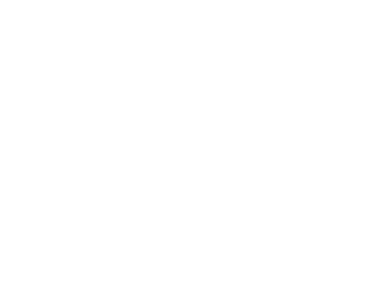 | 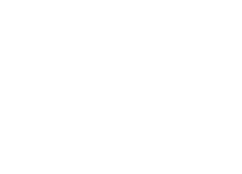 | 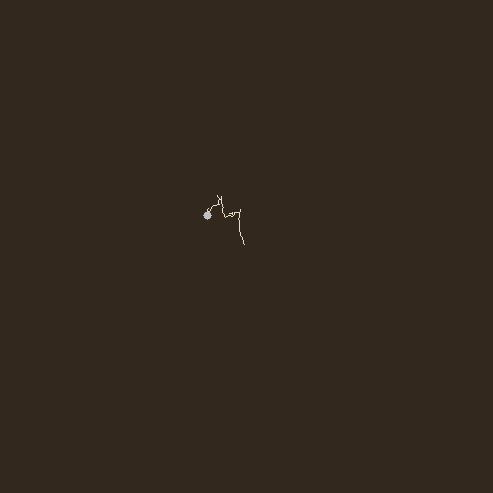 |

### Geometric Shapes
| Original Image | Detected Edges | Processed Path | Sand Table Simulation |
| :---: | :---: | :---: | :---: |
|  | 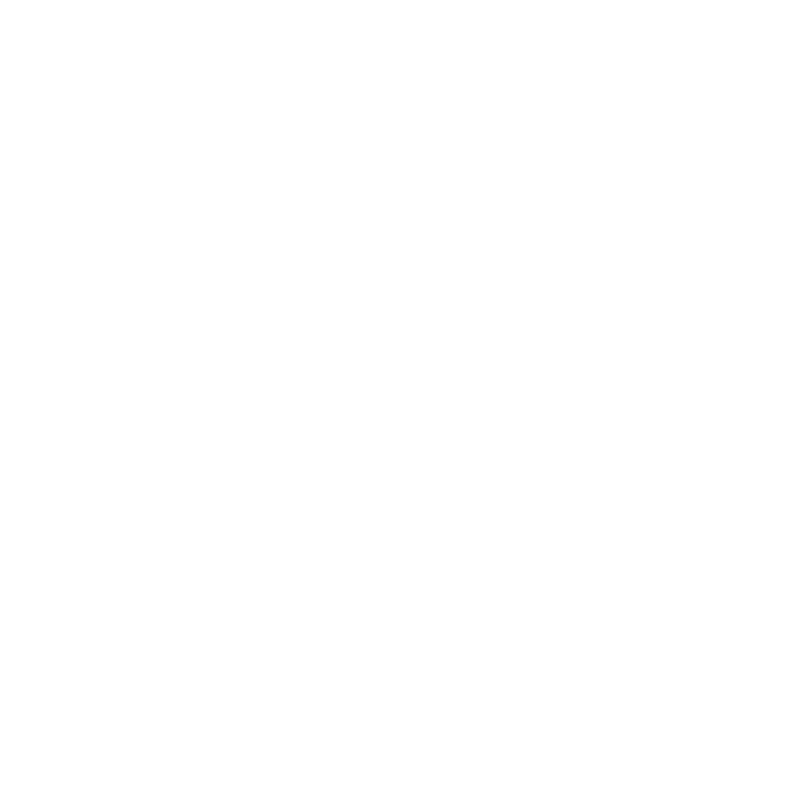 | 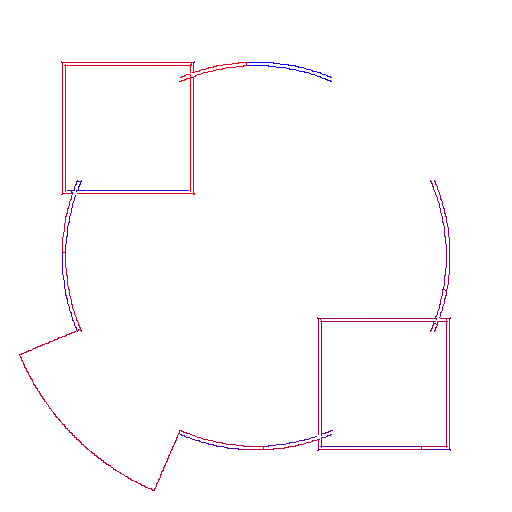 | 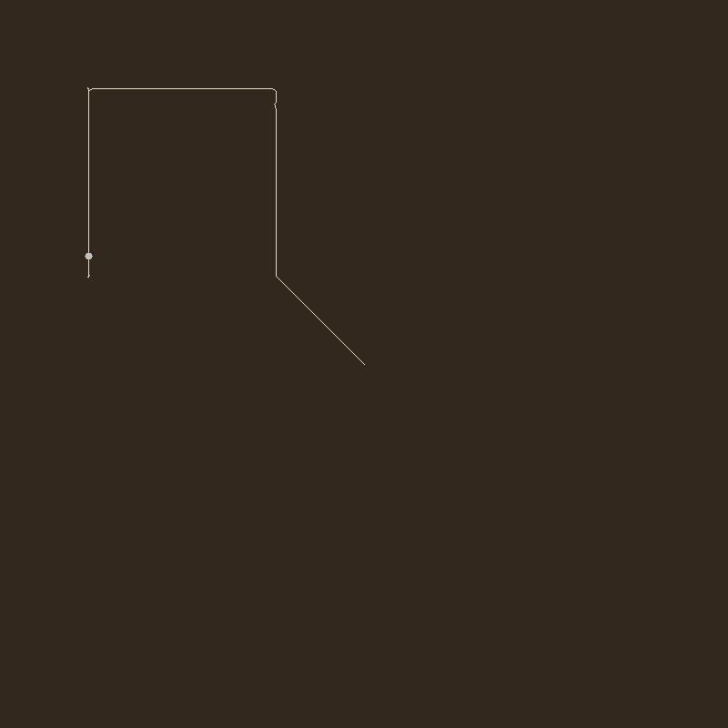 |

### Landmark Architecture (Taj Mahal)
| Original Image | Detected Edges | Processed Path | Sand Table Simulation |
| :---: | :---: | :---: | :---: |
|  |  | 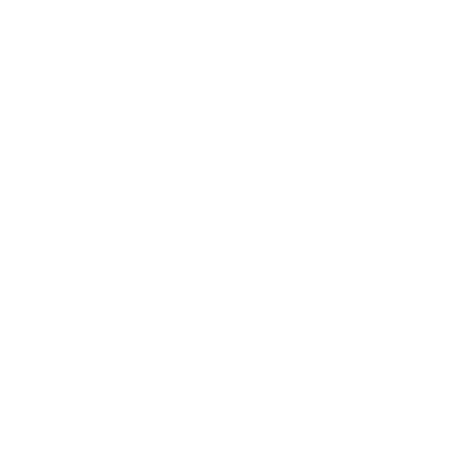 | 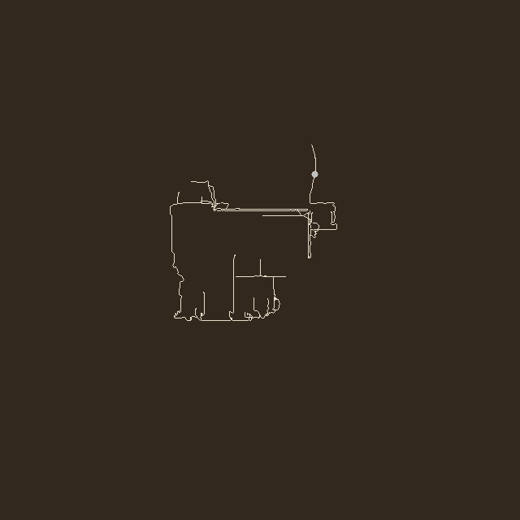 |

### Detailed Portraits (David)
| Original Image | Detected Edges | Processed Path | Sand Table Simulation |
| :---: | :---: | :---: | :---: |
| 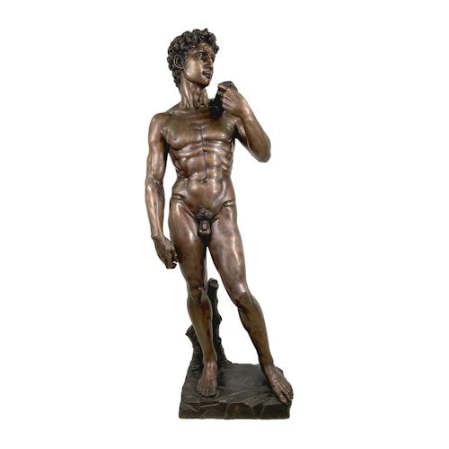 | 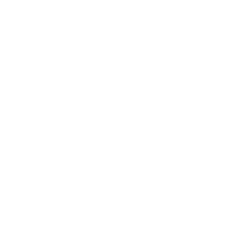 | 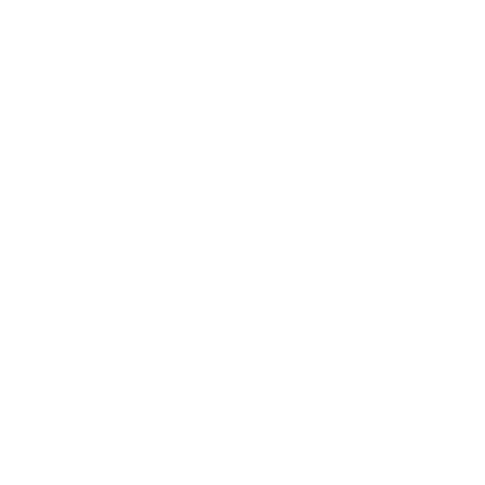 | 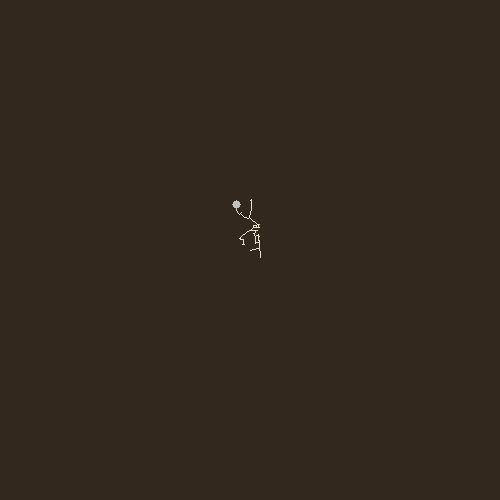 |

## Build Instructions

### Prerequisites
-   `cmake` (version 3.10+)
-   `g++` (or any C++17 compatible compiler)
-   `make`
-   `imagemagick` (runtime dependency for format conversion)

### Compilation
```bash
mkdir build
cd build
cmake ..
make
```

## Usage

### Web Server
1.  Run the server: `./ThrGenCpp`
2.  Open your browser to: `http://localhost:8080`
3.  Upload an image and click "Generate Path".

### CLI Tool
Batch processing and visualization:
```bash
./ThrGenCLI gen input.jpg output.thr --low 50 --high 150 --gif preview.gif --path path.png
```

## Documentation

For a deep dive into the system design, algorithms, and data flow, please refer to the [Architecture Documentation](docs/ARCHITECTURE.md).

## Testing

```bash
# Run unit and integration tests
./ThrGenCpp_Tests
```
