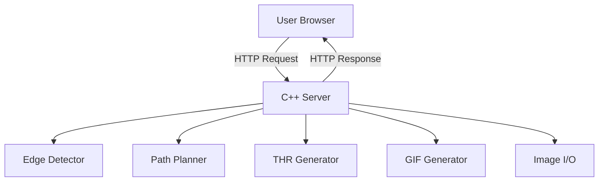

# ThrGen C++ Architecture Documentation

## Overview

ThrGen C++ is a high-performance tool designed to convert raster images into kinetic art tracks (`.thr` files) for Sisyphus tables. It is built with C++17 for speed and minimal dependencies, using a single-page web interface for interaction.

## System Architecture

The application follows a monolithic architecture with a clear separation between the C++ backend and the HTML/JS frontend.

### Components

1.  **Web Server (`main.cpp`)**:
    -   Uses `cpp-httplib` to serve static files and handle the `/process` API endpoint.
    -   Also exposes `/process_thr` to preview existing `.thr` files.
    -   Orchestrates the pipeline: Upload $\to$ Resize/Convert $\to$ Edge Detect $\to$ Plan Path $\to$ Generate THR $\to$ Generate GIF/PNG.
    -   Handles image format normalization with `stb_image` and a native resize path, then falls back to ImageMagick only if `stb_image` cannot load the file.

2.  **Edge Detector (`EdgeDetector.cpp`)**:
    -   **Input**: Raw image data.
    -   **Output**: Vector of edge points.
    -   **Algorithm**: Custom Canny Edge Detection implementation.
        -   **Grayscale**: Luminance conversion (Parallelized).
        -   **Gaussian Blur**: Noise reduction (Parallelized).
        -   **Sobel Operator**: Gradient magnitude and direction calculation (Parallelized).
        -   **Non-Max Suppression**: Thinning edges (Parallelized).
        -   **Hysteresis Thresholding**: Strong-seed collection is parallelized; flood fill is sequential.
    -   **Optimization**: Border pixels (5px margin) are explicitly masked to prevent frame detection artifacts.
    -   **Gap Bridging**: Nearby endpoints are connected with a spatial grid and Bresenham line fill.

3.  **Path Planner (`PathPlanner.cpp`)**:
    -   **Goal**: Convert a cloud of edge points into a single continuous path.
    -   **Stage 1: Component Labeling**: Uses a parallel DSU to group connected pixels into components.
    -   **Stage 2: Local Traversal**: Walks to adjacent unvisited edge pixels when possible.
    -   **Stage 3: Global Search**:
        -   Maintains a spatial grid of already-traversed path points for nearest-point search.
        -   Samples component points with a stride to reduce search cost on large components.
        -   Uses BFS over existing path points to "backtrack" to the best connection point.
        -   Connects to the chosen target with a straight Bresenham segment to keep a continuous path.

4.  **THR Generator (`ThrGenerator.cpp`)**:
    -   **Input**: Ordered Cartesian path.
    -   **Output**: Theta-Rho coordinates.
    -   **Logic**:
        -   Converts $(x, y)$ to $(\theta, \rho)$.
        -   Unwraps $\theta$ to ensure continuous rotation (avoiding jumps from $\pi$ to $-\pi$).
        -   Normalizes $\rho$ to $[0, 1]$.
        -   Adds leading/trailing $\rho=0$ points to anchor the path.

5.  **GIF Generator (`GifGenerator.cpp`)**:
    -   Rasterizes the vector path into a pixel grid.
    -   Uses `gif.h` to write frames.
    -   **Simulation**: Draws a persistent "track" (cumulative frames) and a temporary "ball" overlay to simulate the Sisyphus table effect.
    -   Generates a separate PNG preview mapped to the SisyphusTable viewer's 800x800 coordinate system.

## Key Optimizations

-   **Multi-threading**: `Utils::parallel_for` distributes pixel-wise operations (grayscale, blur, Sobel, NMS), DSU unions, bridge-gap neighbor counts, and global search sampling across cores.
-   **Strided Sampling**: The global search samples every $K$-th point in large components to reduce scan cost.
-   **Intelligent Resizing**: Images > 2048px are downscaled before processing to keep runtime interactive.
-   **Spatial Index (Grid-of-Buckets)**: The planner uses a spatial grid of visited path points for near-neighbor lookup.
-   **Parallel DSU**: Component labeling uses a Disjoint Set Union with lock-based synchronization.
-   **Native C++ Bilinear Downsampling**: Handles common resize operations without ImageMagick; ImageMagick remains a fallback for unsupported formats.
-   **Bridge Gaps Optimization**: Spatial grid acceleration for endpoint bridging.
-   **`std::vector<uint8_t>` over `std::vector<bool>`**: Avoids bit-packing overhead in parallel sections.

## Performance Timing

The server includes timing instrumentation for each pipeline stage:
-   `edge_detection`: End-to-end edge detection (grayscale → blur → sobel → NMS → hysteresis → gap-bridging)
-   `path_planning`: Path planning and traversal
-   `thr_generation`: Polar conversion and serialization
-   `gif_generation`: Animation rendering
-   `png_generation`: Static image output

Timing data is returned in the JSON response under the `timing` key and printed to the console.

## Data Flow

1.  **Upload**: User drops an image.
2.  **Preprocessing**: If the image is too large or `stb_image` can't load it, a native resize is attempted first, then ImageMagick is used as a fallback.
3.  **Loading**: `stb_image` loads raw bytes.
4.  **Detection**: Edges extracted into `std::vector<Point>`.
5.  **Planning**: Points reordered into a valid continuous path (graph traversal).
6.  **Generation**:
    -   Path converted to `.thr` string.
    -   Path rendered to `.gif` animation.
7.  **Response**: JSON containing the `.thr` text, GIF/PNG URLs, preview points, and timing data sent back to browser.
